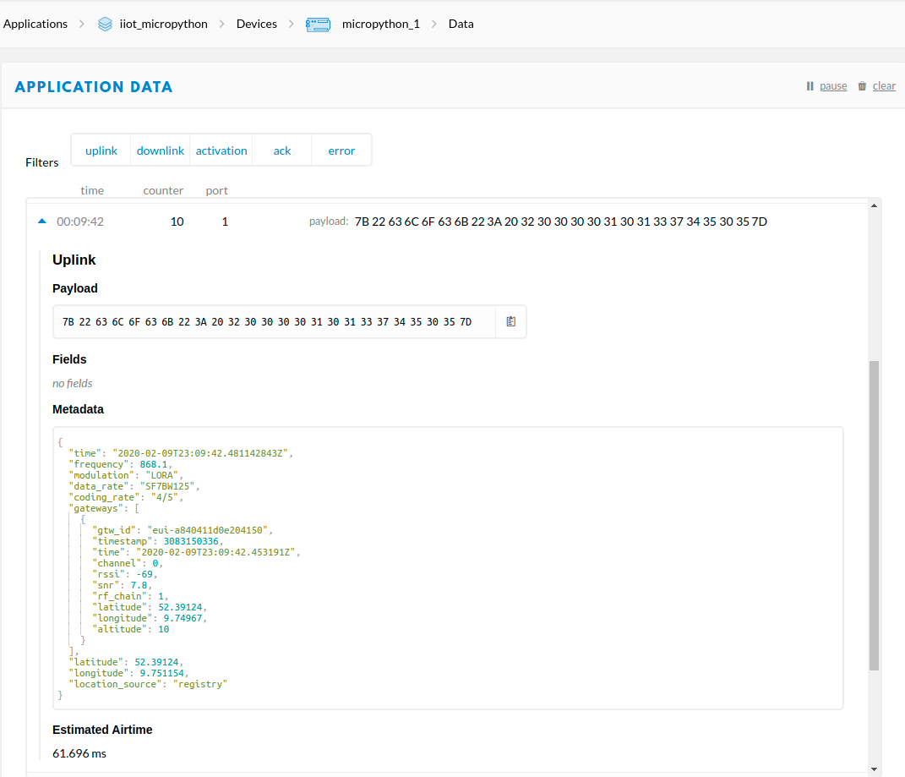
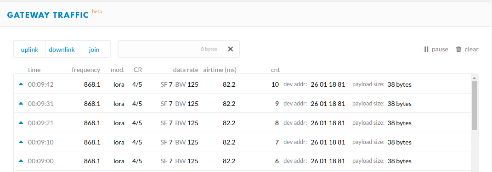

# uPyLora
ESP32 using MicroPython meets LoRaWAN.

# Setup
Use [VSCode and the PyMakr extension](https://lemariva.com/blog/2018/12/micropython-visual-studio-code-as-ide) to upload the code. If you are new on MicroPython, [this tutorial](https://lemariva.com/blog/2017/10/micropython-getting-started) can help you to install the firmware on a ESP32.

Follow these steps to deploy the project:

1. Rename the file `ttn_config.sample.py` to `ttn_config.py`
2. Configure the variables `DEVADDR`, `NWKEY`, and `APP` following the instruction from [this link](https://learn.adafruit.com/using-lorawan-and-the-things-network-with-circuitpython/tinylora-ttn-setup).

# Hardware
* [Wemos® TTGO LORA32 868/915Mhz](https://www.banggood.com/2Pcs-Wemos-TTGO-LORA32-868915Mhz-ESP32-LoRa-OLED-0_96-Inch-Blue-Display-p-1239769.html?p=QW0903761303201409LG) board.
* [M5Stack ATOM](https://www.banggood.com/custlink/KmGDkSGLhO) connected to [LoRa v2.0 board](https://s.click.aliexpress.com/e/_dU6udTr).

# Revision
* 0.2v - first commit with LoRaWAN support

# Licenses
* Apache 2.0

# Results
Two screenshots from the TTN website:

# References
* SX127x driver is based on: [Wei1234c GitHub](https://github.com/Wei1234c/SX127x_driver_for_MicroPython_on_ESP8266). The project was cleaned and made compatible with the [Wemos® TTGO LORA32 868/915Mhz](https://www.banggood.com/2Pcs-Wemos-TTGO-LORA32-868915Mhz-ESP32-LoRa-OLED-0_96-Inch-Blue-Display-p-1239769.html?p=QW0903761303201409LG) board.
* LoRaWAN connection is based on: [Adafruit_CircuitPython_TinyLoRa](https://github.com/adafruit/Adafruit_CircuitPython_TinyLoRa)